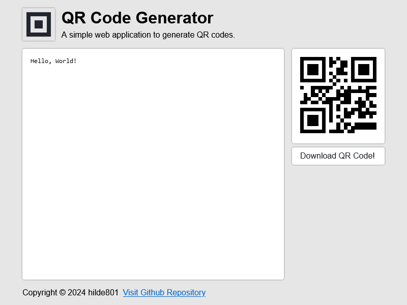

# QR Code Generator




## About

A simple web application to generate QR codes.

## Getting Started

```bash
# Using npm
$ npm install
$ npm run dev

# Using Yarn
$ yarn
$ yarn dev
```

## Credits

- [React](https://react.dev)
- [Vite](https://vitejs.dev)
- [TypeScript](https://www.typescriptlang.org)
- [qrcode](https://www.npmjs.com/package/qrcode)
- [Prettier](https://prettier.io)

## License

QR Code Generator is licensed under the [Apache 2.0 License](./LICENSE.txt).
